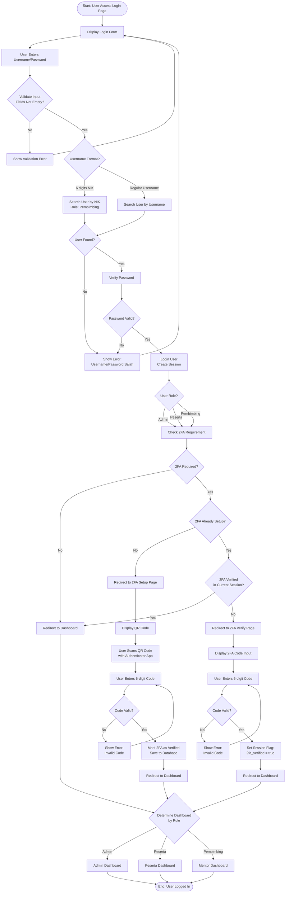
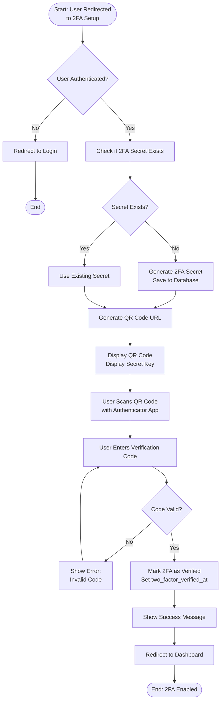
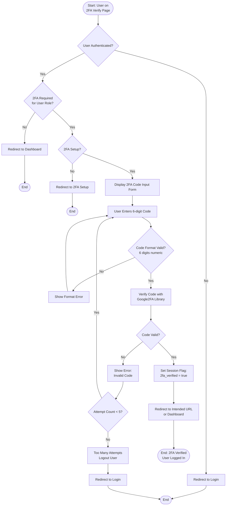
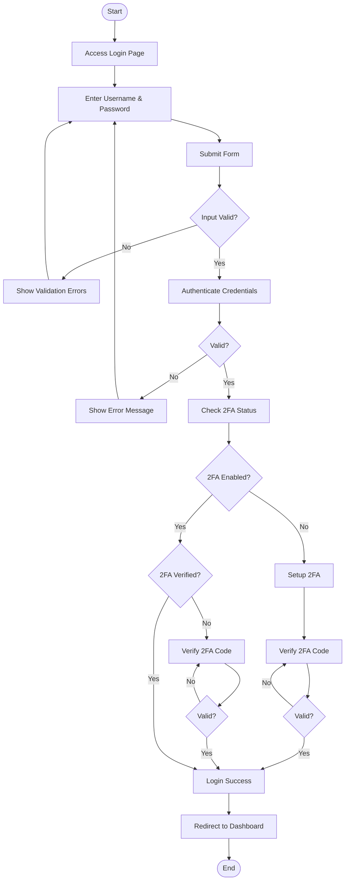
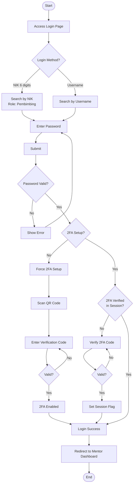
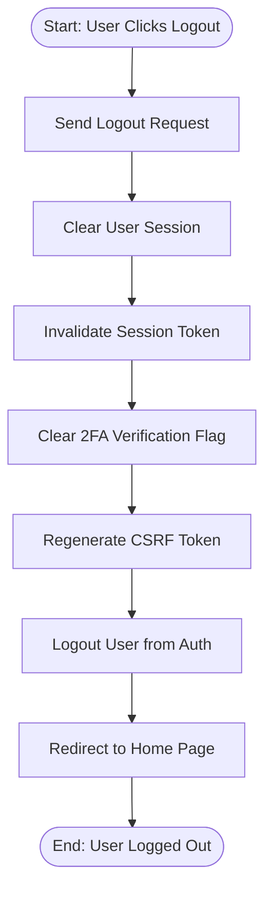
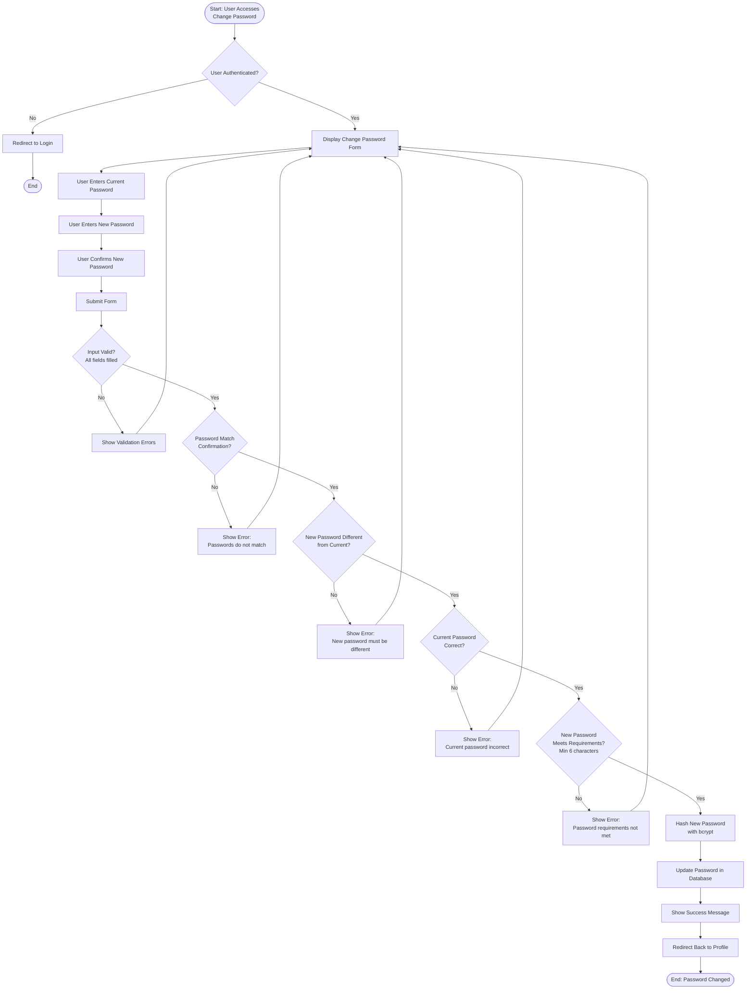
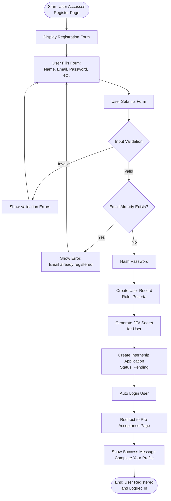

# Activity Diagram - Login Process
## Sistem Penerimaan Magang - PT Telkom Indonesia

Diagram ini menunjukkan alur aktivitas proses login dengan 2FA (Two-Factor Authentication).

---

## Activity Diagram - Login Process (Complete Flow)

---

## Activity Diagram - 2FA Setup Process

---

## Activity Diagram - 2FA Verification Process

---

## Activity Diagram - Login Process (Simplified - Peserta)

---

## Activity Diagram - Login Process (Simplified - Mentor)

---

## Activity Diagram - Logout Process

---

## Activity Diagram - Password Change Process

---

## Activity Diagram - Registration Process

---

## Key Decision Points

### Decision Points dalam Login Flow:

1. **Input Validation**: Apakah username dan password sudah diisi?
2. **Username Format**: Apakah format NIK (6 digits) atau username biasa?
3. **User Found**: Apakah user ditemukan di database?
4. **Password Valid**: Apakah password yang dimasukkan benar?
5. **User Role**: Admin, Peserta, atau Pembimbing?
6. **2FA Required**: Apakah role user memerlukan 2FA?
7. **2FA Setup**: Apakah 2FA sudah di-setup?
8. **2FA Verified**: Apakah 2FA sudah diverifikasi di session?
9. **Code Valid**: Apakah kode 2FA yang dimasukkan valid?

---

**Dibuat**: 2024  
**Versi**: 1.0  
**Sistem**: Penerimaan Magang PT Telkom Indonesia

