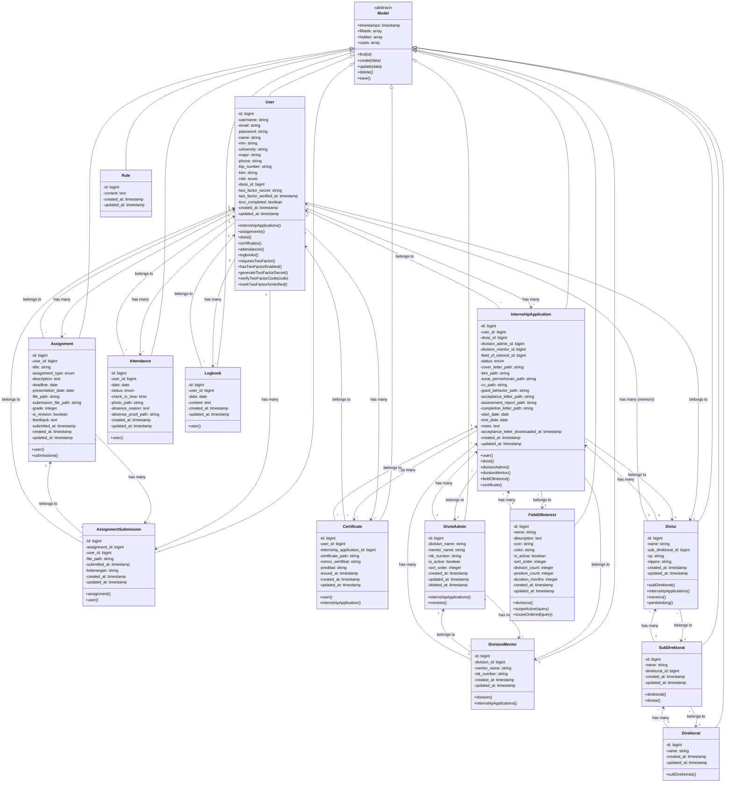

# Class Diagram UML
## Sistem Penerimaan Magang - PT Telkom Indonesia

Diagram ini menunjukkan struktur class dengan atribut, method, dan relasi (inheritance, association, aggregation, composition).

---

## Class Diagram UML - Main Models



---

## Class Diagram UML - Controllers

```mermaid
classDiagram
    class Controller {
        <<abstract>>
        +middleware()
        +validate()
        +authorize()
    }
    
    class AuthController {
        +showLogin()
        +login(request)
        +showRegister()
        +register(request)
        +logout(request)
        +setup2fa()
        +enable2fa(request)
        +show2faVerify()
        +verify2fa(request)
        +showChangePasswordForm()
        +changePassword(request)
        -getDashboardUrl(user)
        -redirectToDashboard(user)
    }
    
    class DashboardController {
        +index()
        +preAcceptance()
        +updateProfile(request)
        +uploadDocuments(request)
        +updateDates(request)
        +completeApplication(request)
        +status()
        +acknowledgePersyaratanTambahan(request)
        +submitAdditionalDocuments(request)
        +assignments()
        +submitAssignment(request, id)
        +certificates()
        +downloadCertificate(id)
        +program()
        +reapply()
        +submitReapply(request)
        +profile()
        +completeTour(request)
        +downloadAcceptanceLetterFlag(request)
        +downloadAcceptanceLetter()
    }
    
    class MentorDashboardController {
        +index()
        +pengajuan()
        +responPengajuan(request, id)
        +showAcceptanceLetterForm(id)
        +previewAcceptanceLetter(request, id)
        +sendAcceptanceLetter(request, id)
        +penugasan()
        +tambahPenugasan(request)
        +editPenugasan(assignment)
        +updatePenugasan(request, assignment)
        +deletePenugasan(assignment)
        +beriNilaiPenugasan(request, assignment)
        +setRevisiPenugasan(request, assignment)
        +sertifikat()
        +uploadSertifikat(request, user)
        +showCertificateForm(user)
        +previewCertificate(request, user)
        +sendCertificate(request, user)
        +profil()
        +laporanPenilaian()
        +getLaporanPenilaianData(request)
        +uploadLaporanPenilaian(request, applicationId)
        -getAcceptanceLetterData(request, application)
        -getCertificateData(request, user, application)
    }
    
    class AdminController {
        +dashboard()
        +applications()
        +approveApplication(request, id)
        +rejectApplication(request, id)
        +participants()
        +uploadAcceptanceLetter(request, applicationId)
        +downloadAssessmentReport(applicationId)
        +uploadCompletionLetter(request, applicationId)
        +uploadCertificate(request, userId)
        +divisions()
        +indexDivisions()
        +createDivision()
        +storeDivision(request)
        +editDivision(id)
        +updateDivision(request, id)
        +toggleDivision(request, id)
        +destroyDivision(id)
        +mentors()
        +mentorDetail(id)
        +resetMentorPassword(request, id)
        +editRules()
        +updateRules(request)
        +fields()
        +createField()
        +storeField(request)
        +editField(field)
        +updateField(request, field)
        +toggleFieldStatus(request, field)
        +deleteField(field)
        +report()
        +getReportData(request)
        +exportReportPdf(request)
        +exportReportExcel(request)
        +direktoratStore(request)
        +direktoratUpdate(request, id)
        +direktoratDelete(id)
    }
    
    class AttendanceController {
        +index()
        +checkIn(request)
        +absent(request)
        +mentorIndex()
        +adminIndex()
    }
    
    class LogbookController {
        +index()
        +store(request)
        +update(request, id)
        +destroy(id)
        +mentorIndex()
        +adminIndex()
        +getMentorsByDivision(request)
    }
    
    class HomeController {
        +index()
        +about()
        +program()
    }
    
    class InternshipController {
        +index()
        +apply(divisi)
        +submitApply(request, divisi)
    }
    
    %% Inheritance
    Controller <|-- AuthController
    Controller <|-- DashboardController
    Controller <|-- MentorDashboardController
    Controller <|-- AdminController
    Controller <|-- AttendanceController
    Controller <|-- LogbookController
    Controller <|-- HomeController
    Controller <|-- InternshipController
    
    %% Dependencies (uses)
    AuthController ..> User : uses
    DashboardController ..> InternshipApplication : uses
    DashboardController ..> Assignment : uses
    DashboardController ..> Certificate : uses
    MentorDashboardController ..> InternshipApplication : uses
    MentorDashboardController ..> Assignment : uses
    MentorDashboardController ..> Certificate : uses
    AdminController ..> InternshipApplication : uses
    AdminController ..> User : uses
    AdminController ..> DivisiAdmin : uses
    AttendanceController ..> Attendance : uses
    LogbookController ..> Logbook : uses
    InternshipController ..> InternshipApplication : uses
```



---

## Class Diagram - Relationships Detail

### Composition Relationship (Strong Ownership)
- **User** ◄◆ **InternshipApplication**: Jika User dihapus, InternshipApplication juga dihapus (CASCADE)
- **User** ◄◆ **Assignment**: Jika User dihapus, Assignment juga dihapus
- **User** ◄◆ **Certificate**: Jika User dihapus, Certificate juga dihapus
- **Assignment** ◄◆ **AssignmentSubmission**: Jika Assignment dihapus, AssignmentSubmission juga dihapus

### Aggregation Relationship (Weak Ownership)
- **Divisi** ◄◇ **User** (mentors): User bisa exist tanpa Divisi
- **FieldOfInterest** ◄◇ **InternshipApplication**: InternshipApplication bisa exist tanpa FieldOfInterest

### Association Relationship (Reference)
- **InternshipApplication** ── **DivisionMentor**: Reference relationship
- **Direktorat** ── **SubDirektorat**: Hierarchical relationship
- **SubDirektorat** ── **Divisi**: Hierarchical relationship

---

## Class Diagram dengan Relasi Lengkap

```mermaid
classDiagram
    class User {
        +id
        +username
        +email
        +password
        +role
        +internshipApplications()* InternshipApplication
        +assignments()* Assignment
        +certificates()* Certificate
        +attendances()* Attendance
        +logbooks()* Logbook
    }
    
    class InternshipApplication {
        +id
        +user_id
        +status
        +user() User
        +divisionMentor() DivisionMentor
        +certificate() Certificate
    }
    
    class Assignment {
        +id
        +user_id
        +title
        +grade
        +user() User
        +submissions()* AssignmentSubmission
    }
    
    class Certificate {
        +id
        +user_id
        +certificate_path
        +user() User
        +internshipApplication() InternshipApplication
    }
    
    class DivisionMentor {
        +id
        +division_id
        +mentor_name
        +internshipApplications()* InternshipApplication
    }
    
    %% Composition (Strong - filled diamond)
    User "1" ◄◆ "*" InternshipApplication : creates
    User "1" ◄◆ "*" Assignment : receives
    User "1" ◄◆ "*" Certificate : receives
    Assignment "1" ◄◆ "*" AssignmentSubmission : contains
    
    %% Aggregation (Weak - empty diamond)
    DivisionMentor "1" ◄◇ "*" InternshipApplication : supervises
    
    %% Association (Simple line)
    User "1" ── "*" Certificate : owns
    InternshipApplication "1" ── "*" Certificate : generates
```

---

**Keterangan Relasi:**

1. **Inheritance (◄──)**: Semua Model mewarisi dari Eloquent Model
2. **Composition (◄◆)**: Strong ownership, jika parent dihapus, child juga dihapus
3. **Aggregation (◄◇)**: Weak ownership, child bisa exist tanpa parent
4. **Association (──)**: Simple reference relationship
5. **Dependency (..>)**: Controller menggunakan Model

---

**Dibuat**: 2024  
**Versi**: 1.0  
**Sistem**: Penerimaan Magang PT Telkom Indonesia

