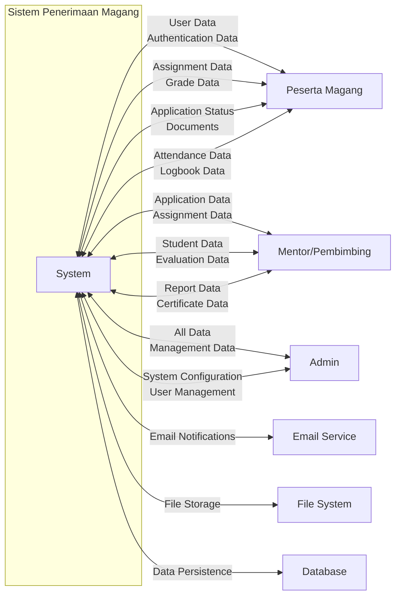
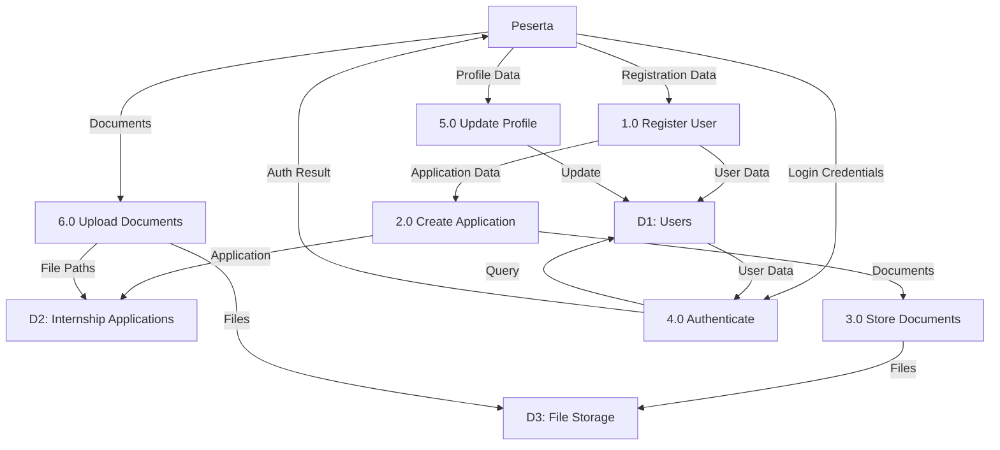
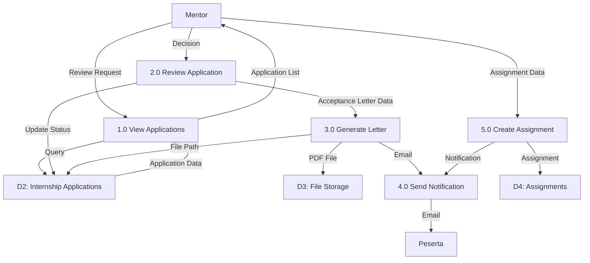
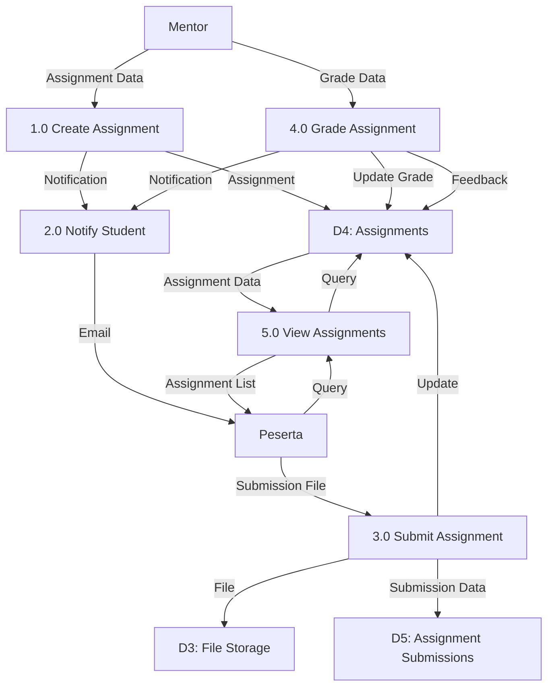
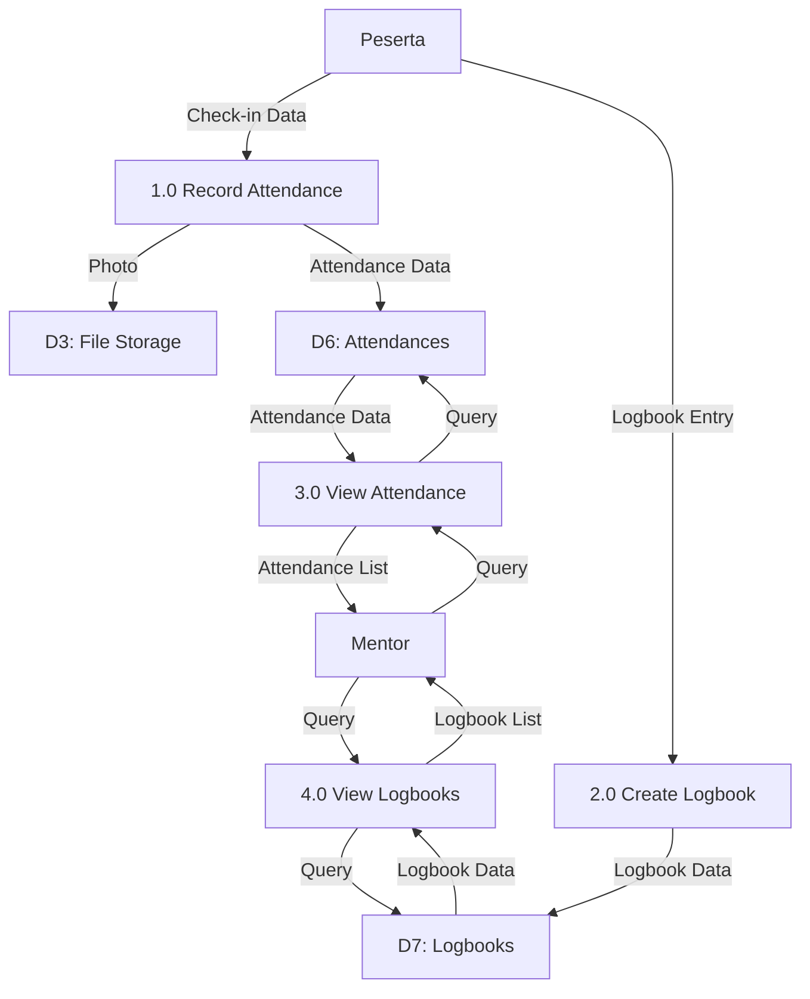
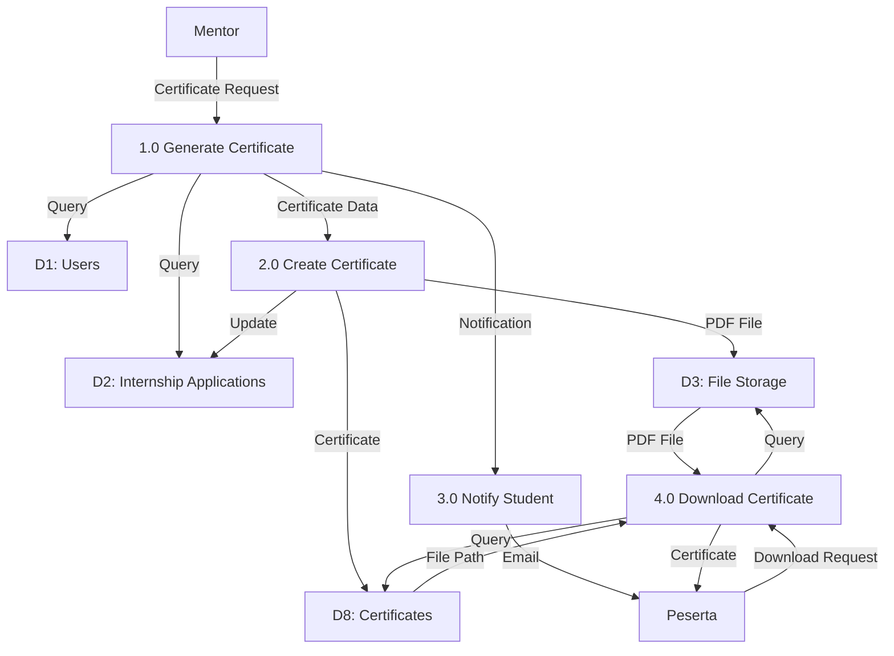
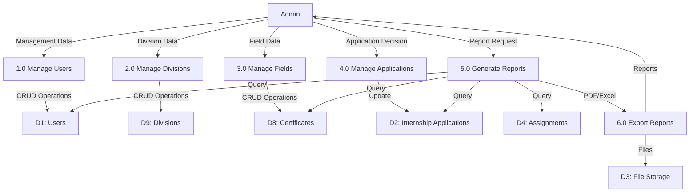
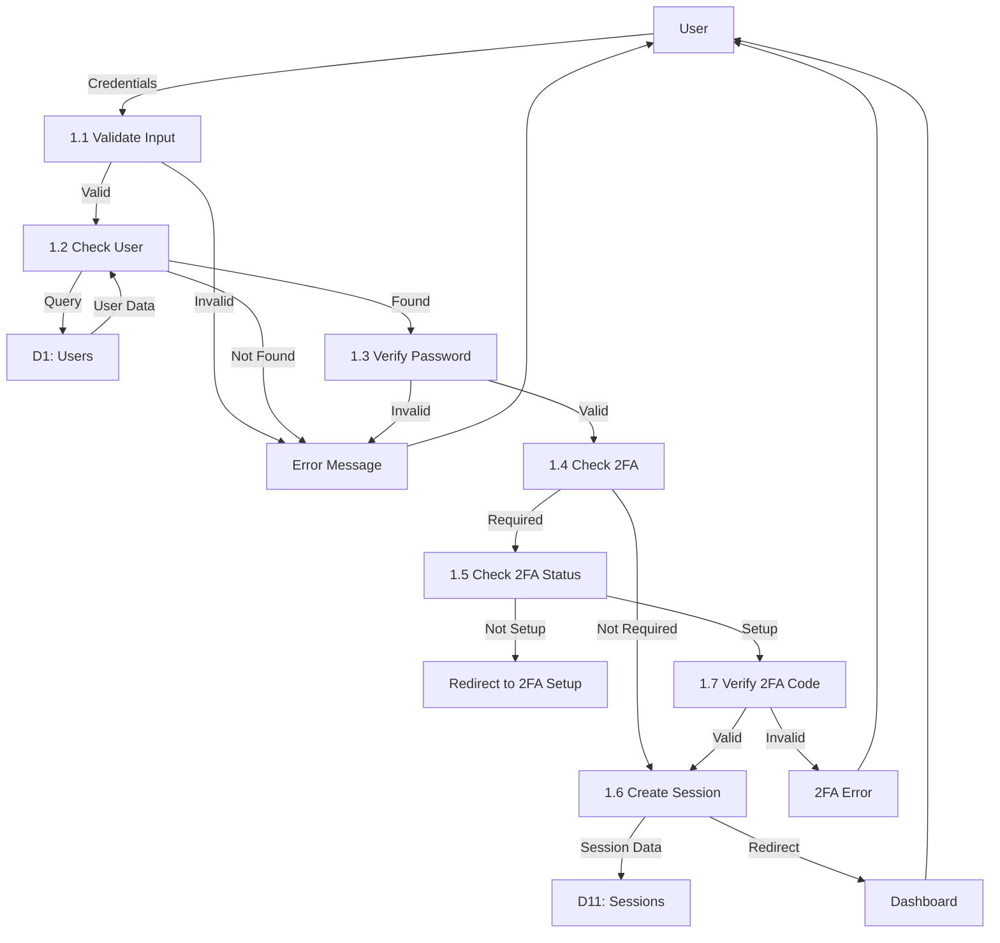

# Data Flow Diagram (DFD)
## Sistem Penerimaan Magang - PT Telkom Indonesia

Diagram ini menunjukkan alur data dalam sistem dari level konteks hingga level detail.

---

## Context Diagram (Level 0)

---

## DFD Level 1 - Registration & Application Process

---

## DFD Level 1 - Application Review Process

---

## DFD Level 1 - Assignment & Evaluation Process

---

## DFD Level 1 - Attendance & Logbook Process

---

## DFD Level 1 - Certificate Process

---

## DFD Level 1 - Admin Management Process

---

## DFD Level 2 - Detailed Login Process

---

## Data Store Dictionary

| Data Store | Description | Contents |
|-----------|-------------|----------|
| **D1: Users** | User accounts | id, username, email, password, role, profile data |
| **D2: Internship Applications** | Application records | id, user_id, status, documents, dates |
| **D3: File Storage** | File system | Documents, photos, PDFs, certificates |
| **D4: Assignments** | Assignment records | id, user_id, title, description, grade |
| **D5: Assignment Submissions** | Submission records | id, assignment_id, file_path, submitted_at |
| **D6: Attendances** | Attendance records | id, user_id, date, status, photo |
| **D7: Logbooks** | Logbook entries | id, user_id, date, content |
| **D8: Certificates** | Certificate records | id, user_id, certificate_path, issued_at |
| **D9: Divisions** | Division data | id, name, mentor info, status |
| **D10: Field of Interests** | Field definitions | id, name, description, active status |
| **D11: Sessions** | Session data | session_id, user_id, data, expiry |

---

## External Entity Dictionary

| External Entity | Description | Interactions |
|----------------|-------------|--------------|
| **Peserta Magang** | Student/Intern | Register, login, submit applications, assignments, attendance, logbook |
| **Mentor/Pembimbing** | Supervisor | Review applications, create assignments, grade, generate certificates |
| **Admin** | Administrator | Manage users, divisions, fields, approve applications, generate reports |
| **Email Service** | Email provider | Send notifications, acceptance letters, certificates |
| **File System** | Storage system | Store and retrieve files |
| **Database** | Data persistence | Store and query all data |

---

**Dibuat**: 2024  
**Versi**: 1.0  
**Sistem**: Penerimaan Magang PT Telkom Indonesia

