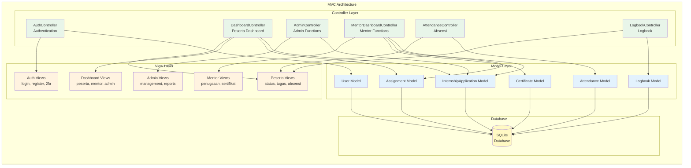
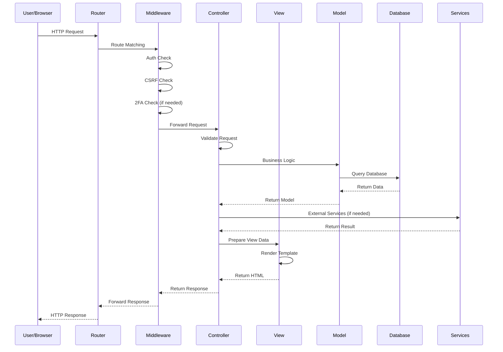
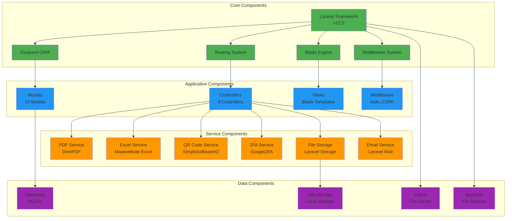
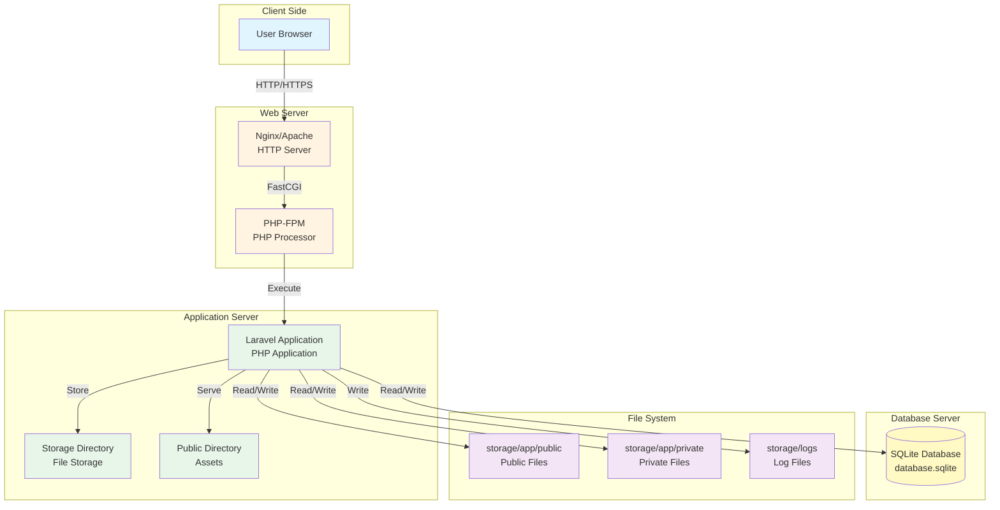

# High-Level Architecture Diagram
## Sistem Penerimaan Magang - PT Telkom Indonesia

Diagram ini menunjukkan arsitektur sistem secara keseluruhan dari level tinggi.

---

## High-Level Architecture Diagram

```mermaid
graph TB
    subgraph "Client Layer"
        A[Web Browser<br/>Chrome, Firefox, Safari]
        A1[Mobile Browser<br/>Responsive Design]
    end
    
    subgraph "Presentation Layer"
        B[Blade Templates<br/>Views]
        B1[CSS Framework<br/>Bootstrap]
        B2[JavaScript<br/>Vanilla JS + Chart.js]
        B3[Vite Assets<br/>Build System]
    end
    
    subgraph "Application Layer - Laravel Framework"
        C[Routing Layer<br/>routes/web.php]
        C1[Middleware<br/>Auth, CSRF, 2FA]
        C2[Controllers<br/>Business Logic]
        C3[Validation<br/>Request Validation]
    end
    
    subgraph "Business Logic Layer"
        D[Models<br/>Eloquent ORM]
        D1[Services<br/>File Processing]
        D2[Mail Services<br/>Email Notifications]
        D3[PDF Services<br/>DomPDF]
        D4[Excel Services<br/>Maatwebsite Excel]
        D5[QR Code Services<br/>SimpleSoftwareIO]
    end
    
    subgraph "Data Access Layer"
        E[Eloquent ORM<br/>Database Abstraction]
        E1[Query Builder<br/>Complex Queries]
        E2[File Storage<br/>Laravel Storage]
    end
    
    subgraph "Data Persistence Layer"
        F[(SQLite Database<br/>Primary Data Store)]
        F1[File System<br/>Storage/app/public]
        F2[File System<br/>Storage/app/private]
        F3[Cache<br/>Session & Application Cache]
        F4[Logs<br/>Laravel Log Files]
    end
    
    subgraph "External Services"
        G[Email Service<br/>SMTP/Mail Driver]
        G1[PDF Generator<br/>DomPDF Library]
        G2[Excel Export<br/>PhpSpreadsheet]
        G3[QR Code<br/>Bacon QR Code]
        G4[2FA Service<br/>Google2FA]
    end
    
    subgraph "Security Layer"
        H[Authentication<br/>Session-based]
        H1[Authorization<br/>Role-based Access]
        H2[2FA<br/>Two-Factor Auth]
        H3[CSRF Protection<br/>Token-based]
        H4[Password Hashing<br/>bcrypt]
    end
    
    A --> B
    A1 --> B
    B --> B1
    B --> B2
    B --> B3
    
    B --> C
    C --> C1
    C1 --> C2
    C2 --> C3
    
    C2 --> D
    D --> D1
    D --> D2
    D --> D3
    D --> D4
    D --> D5
    
    D --> E
    E --> E1
    D1 --> E2
    
    E --> F
    E1 --> F
    E2 --> F1
    E2 --> F2
    C1 --> F3
    C2 --> F4
    
    D2 --> G
    D3 --> G1
    D4 --> G2
    D5 --> G3
    C1 --> G4
    
    C1 --> H
    C2 --> H1
    C1 --> H2
    C1 --> H3
    H --> H4
    
    style A fill:#e1f5ff
    style A1 fill:#e1f5ff
    style B fill:#fff4e1
    style B1 fill:#fff4e1
    style B2 fill:#fff4e1
    style B3 fill:#fff4e1
    style C fill:#e8f5e9
    style C1 fill:#e8f5e9
    style C2 fill:#e8f5e9
    style C3 fill:#e8f5e9
    style D fill:#f3e5f5
    style D1 fill:#f3e5f5
    style D2 fill:#f3e5f5
    style D3 fill:#f3e5f5
    style D4 fill:#f3e5f5
    style D5 fill:#f3e5f5
    style E fill:#fce4ec
    style E1 fill:#fce4ec
    style E2 fill:#fce4ec
    style F fill:#fff9c4
    style F1 fill:#fff9c4
    style F2 fill:#fff9c4
    style F3 fill:#fff9c4
    style F4 fill:#fff9c4
    style G fill:#e0f2f1
    style G1 fill:#e0f2f1
    style G2 fill:#e0f2f1
    style G3 fill:#e0f2f1
    style G4 fill:#e0f2f1
    style H fill:#ffebee
    style H1 fill:#ffebee
    style H2 fill:#ffebee
    style H3 fill:#ffebee
    style H4 fill:#ffebee
```

---

## Arsitektur MVC (Model-View-Controller)

---

## Arsitektur Request-Response Flow

---

## Component Diagram

---

## Deployment Architecture

---

## Technology Stack

| Layer | Technology | Version | Purpose |
|-------|-----------|---------|---------|
| **Framework** | Laravel | 12.0 | PHP Web Framework |
| **Database** | SQLite | 3.x | Primary Database |
| **Template Engine** | Blade | Laravel | Server-side Rendering |
| **CSS Framework** | Bootstrap | 5.x | UI Styling |
| **JavaScript** | Vanilla JS + Chart.js | Latest | Client-side Logic |
| **PDF Generation** | DomPDF | 3.1 | PDF Documents |
| **Excel Export** | Maatwebsite Excel | 3.1 | Excel Reports |
| **QR Code** | SimpleSoftwareIO QrCode | Latest | QR Code Generation |
| **2FA** | Google2FA (PragmaRX) | 9.0 | Two-Factor Authentication |
| **Build Tool** | Vite | Latest | Asset Bundling |
| **HTTP Server** | Nginx/Apache | Latest | Web Server |
| **PHP** | PHP | 8.2+ | Runtime |

---

**Dibuat**: 2024  
**Versi**: 1.0  
**Sistem**: Penerimaan Magang PT Telkom Indonesia

