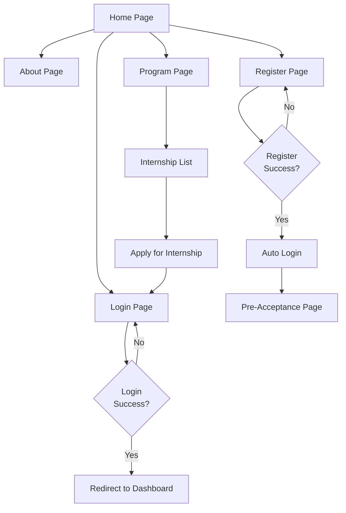
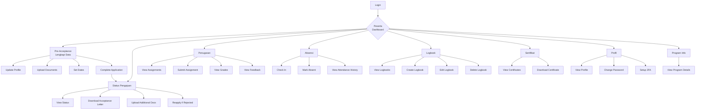
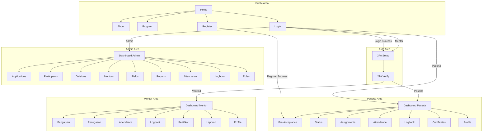
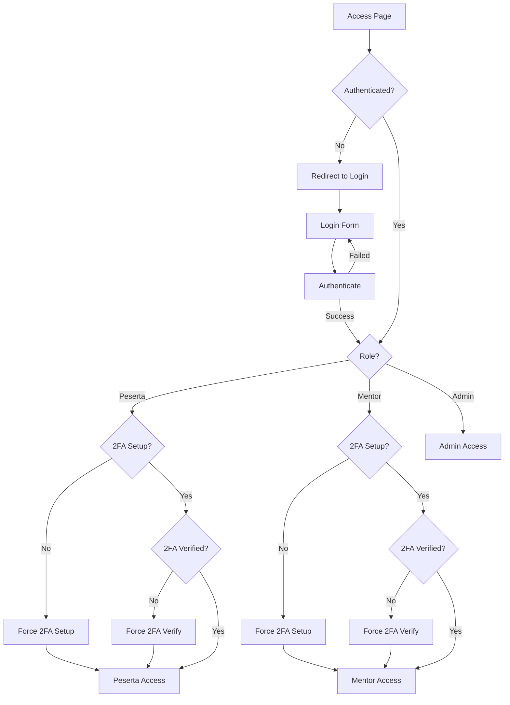

# Navigation Flow Diagram
## Sistem Penerimaan Magang - PT Telkom Indonesia

Diagram ini menunjukkan alur navigasi pengguna melalui aplikasi berdasarkan role mereka.

---

## Navigation Flow - Public (Non-Authenticated)

---

## Navigation Flow - Peserta (Participant)

---

## Navigation Flow - Mentor (Pembimbing)

```mermaid
graph TD
    A[Login] --> B{2FA<br/>Setup?}
    B -->|No| C[2FA Setup Page]
    B -->|Yes| D{2FA<br/>Verified?}
    D -->|No| E[2FA Verify Page]
    D -->|Yes| F[Mentor Dashboard]
    C --> F
    E --> F
    
    F --> G[Pengajuan Magang]
    F --> H[Penugasan & Penilaian]
    F --> I[Absensi]
    F --> J[Logbook]
    F --> K[Sertifikat]
    F --> L[Laporan Penilaian]
    F --> M[Profil]
    
    G --> G1[View Pengajuan]
    G --> G2[Accept/Reject]
    G --> G3[Generate Acceptance Letter]
    G --> G4[Preview Letter]
    G --> G5[Send Letter]
    
    H --> H1[View Assignments]
    H --> H2[Create Assignment]
    H --> H3[Edit Assignment]
    H --> H4[Delete Assignment]
    H --> H5[Grade Assignment]
    H --> H6[Set Revision]
    H --> H7[View Submissions]
    
    I --> I1[View Attendance]
    I --> I2[Filter by Date]
    I --> I3[View Participant Attendance]
    
    J --> J1[View Logbooks]
    J --> J2[Filter by Participant]
    J --> J3[View Logbook Details]
    
    K --> K1[View Participants]
    K --> K2[Select Participant]
    K --> K3[Generate Certificate]
    K --> K4[Preview Certificate]
    K --> K5[Send Certificate]
    
    L --> L1[View Reports]
    L --> L2[Filter Reports]
    L --> L3[Upload Assessment Report]
    L --> L4[Download Report]
    L --> L5[Delete Report]
    
    M --> M1[View Profile]
    M --> M2[Change Password]
```

---

## Navigation Flow - Admin

```mermaid
graph TD
    A[Login] --> B[Admin Dashboard]
    
    B --> C[Applications<br/>Pengajuan]
    B --> D[Participants<br/>Peserta]
    B --> E[Divisions<br/>Divisi]
    B --> F[Mentors<br/>Pembimbing]
    B --> G[Fields<br/>Bidang Peminatan]
    B --> H[Reports<br/>Laporan]
    B --> I[Attendance]
    B --> J[Logbook]
    B --> K[Rules]
    
    C --> C1[View Applications]
    C --> C2[Approve Application]
    C --> C3[Reject Application]
    C --> C4[Filter Applications]
    
    D --> D1[View Participants]
    D --> D2[Upload Acceptance Letter]
    D --> D3[Upload Completion Letter]
    D --> D4[Upload Certificate]
    D --> D5[Download Assessment Report]
    D --> D6[Filter Participants]
    
    E --> E1[View Divisions]
    E --> E2[Create Division]
    E --> E3[Edit Division]
    E --> E4[Delete Division]
    E --> E5[Toggle Active Status]
    E --> E6[Manage Direktorat]
    E --> E7[Manage SubDirektorat]
    E --> E8[Manage Divisi]
    
    F --> F1[View Mentors]
    F --> F2[View Mentor Detail]
    F --> F3[Reset Password]
    
    G --> G1[View Fields]
    G --> G2[Create Field]
    G --> G3[Edit Field]
    G --> G4[Delete Field]
    G --> G5[Toggle Active Status]
    
    H --> H1[View Reports]
    H --> H2[Filter Reports]
    H --> H3[Export PDF]
    H --> H4[Export Excel]
    H --> H5[View Classifications]
    
    I --> I1[View All Attendance]
    I --> I2[Filter by Date]
    I --> I3[Filter by Participant]
    
    J --> J1[View All Logbooks]
    J --> J2[Filter by Mentor]
    J --> J3[Filter by Participant]
    
    K --> K1[View Rules]
    K --> K2[Edit Rules]
    K --> K3[Update Rules]
```

---

## Navigation Flow - Complete System Map

---

## Navigation Flow - Authentication & Authorization

---

## Navigation Flow - Page Access Matrix

| Page | Public | Peserta | Mentor | Admin |
|------|--------|---------|--------|-------|
| Home | ✅ | ✅ | ✅ | ✅ |
| About | ✅ | ✅ | ✅ | ✅ |
| Program | ✅ | ✅ | ✅ | ✅ |
| Login | ✅ | ✅ | ✅ | ✅ |
| Register | ✅ | ❌ | ❌ | ❌ |
| Dashboard Peserta | ❌ | ✅ | ❌ | ❌ |
| Dashboard Mentor | ❌ | ❌ | ✅ | ❌ |
| Dashboard Admin | ❌ | ❌ | ❌ | ✅ |
| Pre-Acceptance | ❌ | ✅ | ❌ | ❌ |
| Status | ❌ | ✅ | ❌ | ❌ |
| Assignments | ❌ | ✅ | ✅ | ❌ |
| Attendance | ❌ | ✅ | ✅ | ✅ |
| Logbook | ❌ | ✅ | ✅ | ✅ |
| Certificates | ❌ | ✅ | ✅ | ❌ |
| Pengajuan | ❌ | ❌ | ✅ | ❌ |
| Penugasan | ❌ | ❌ | ✅ | ❌ |
| Applications | ❌ | ❌ | ❌ | ✅ |
| Participants | ❌ | ❌ | ❌ | ✅ |
| Divisions | ❌ | ❌ | ❌ | ✅ |
| Mentors | ❌ | ❌ | ❌ | ✅ |
| Reports | ❌ | ❌ | ✅ | ✅ |

---

**Dibuat**: 2024  
**Versi**: 1.0  
**Sistem**: Penerimaan Magang PT Telkom Indonesia

