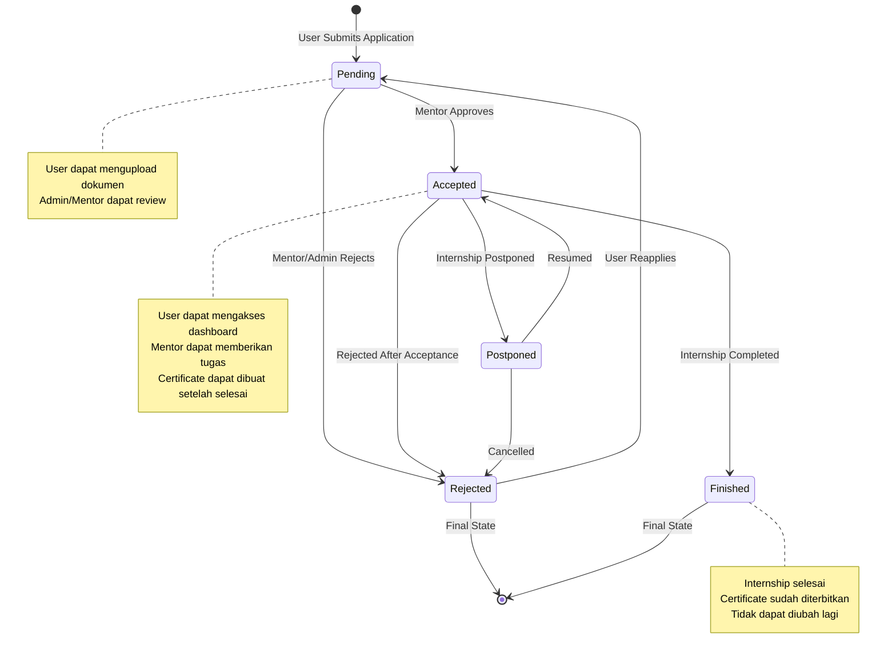
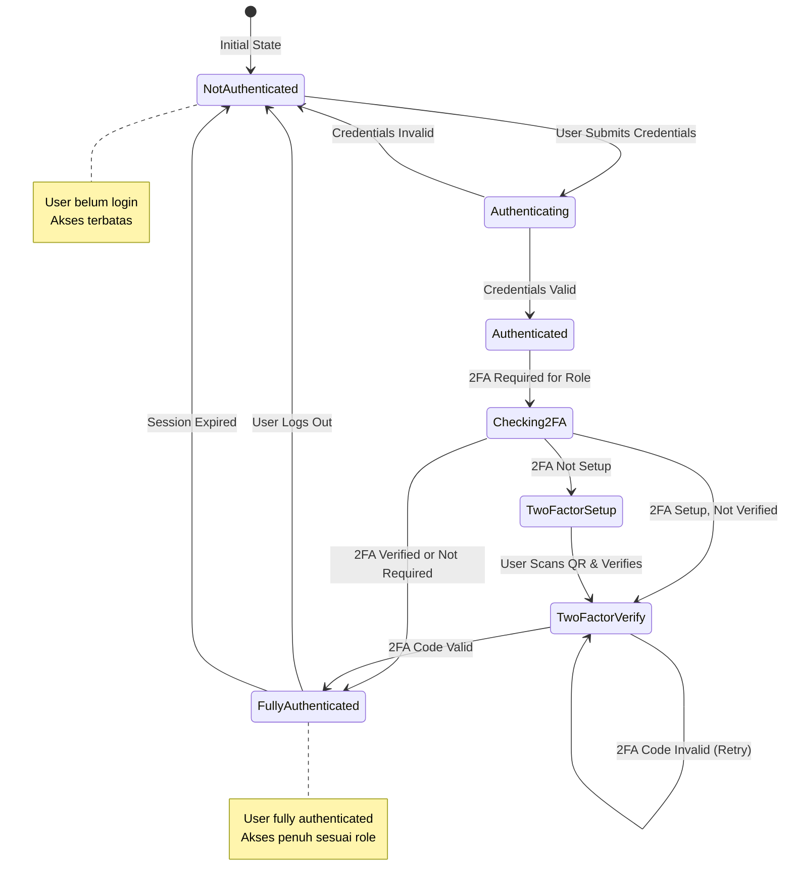
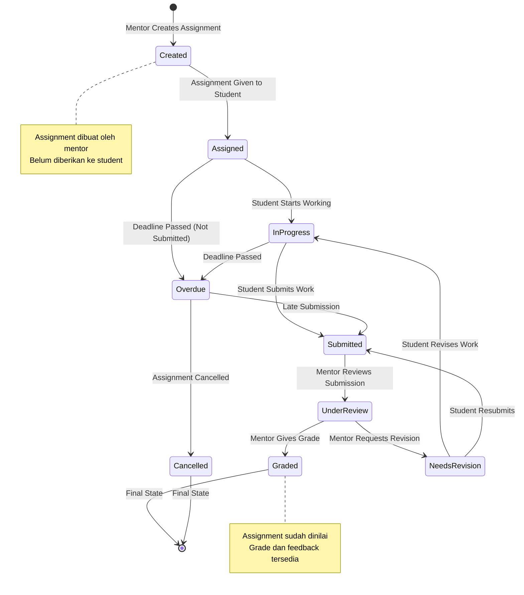
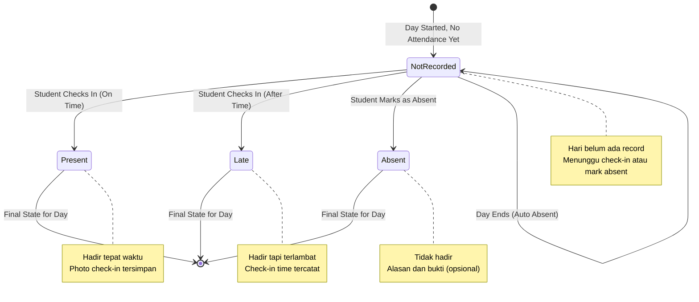
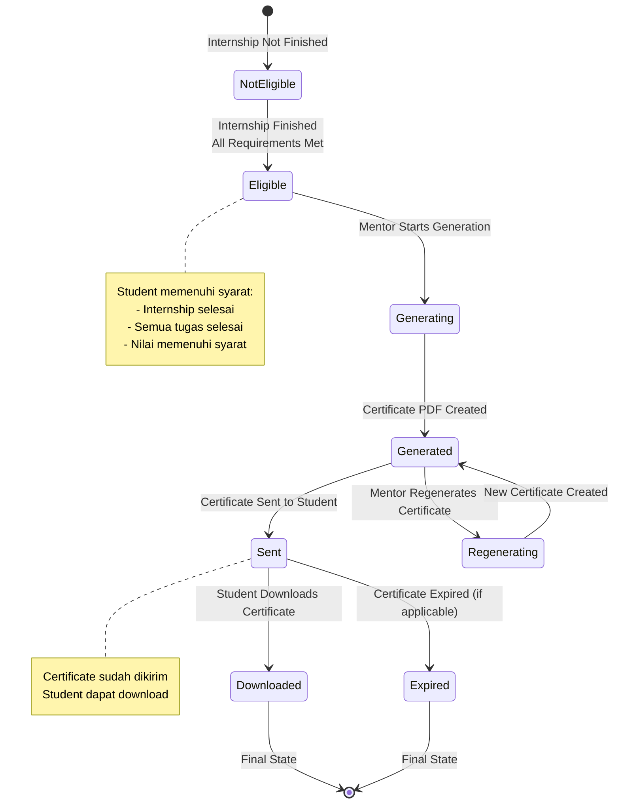
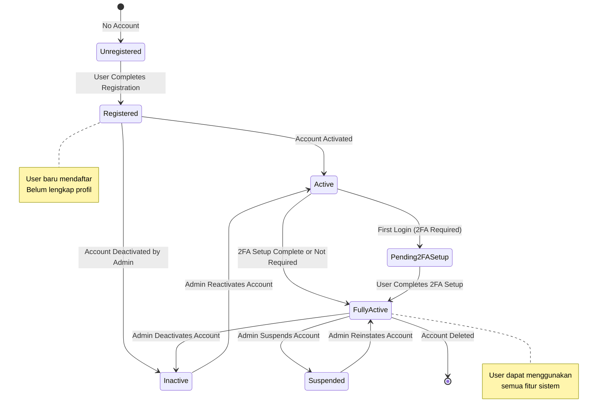
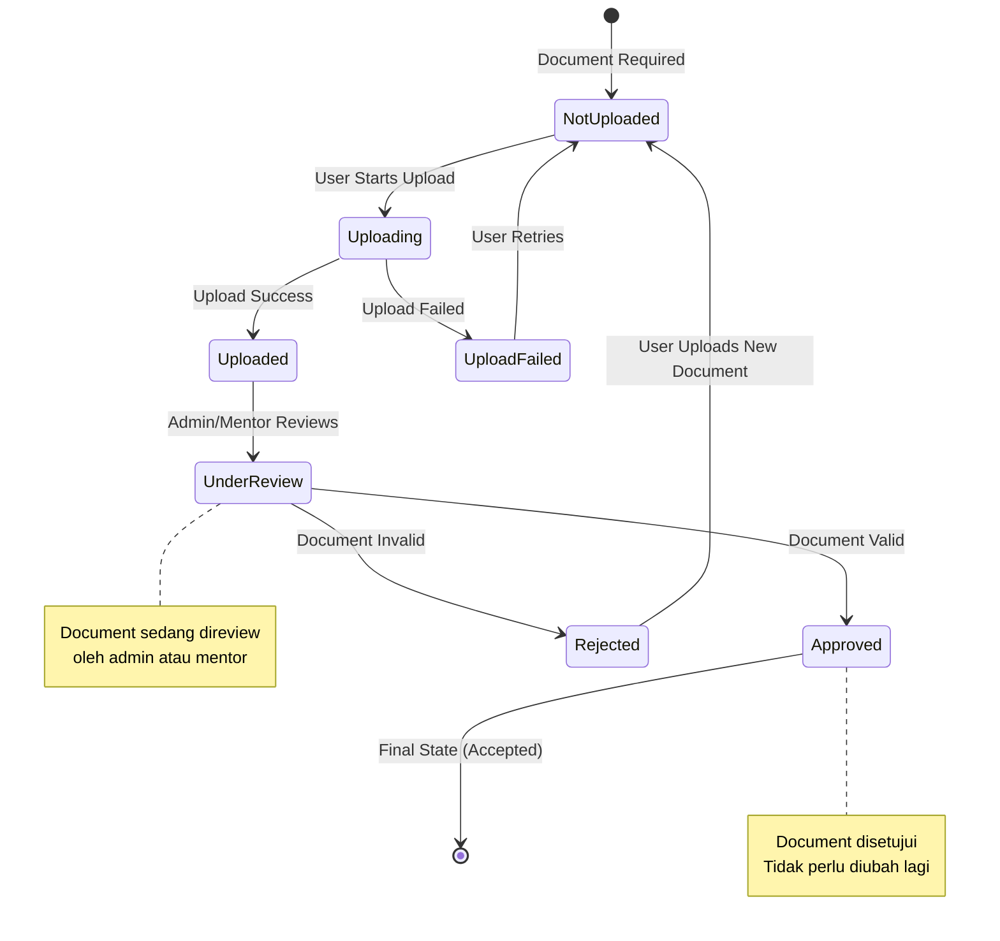
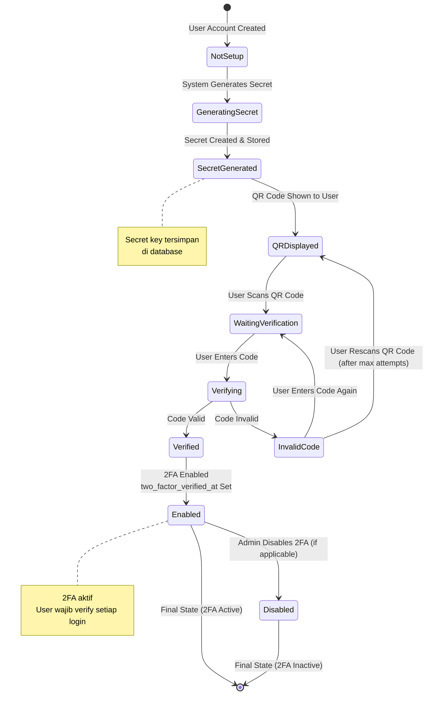
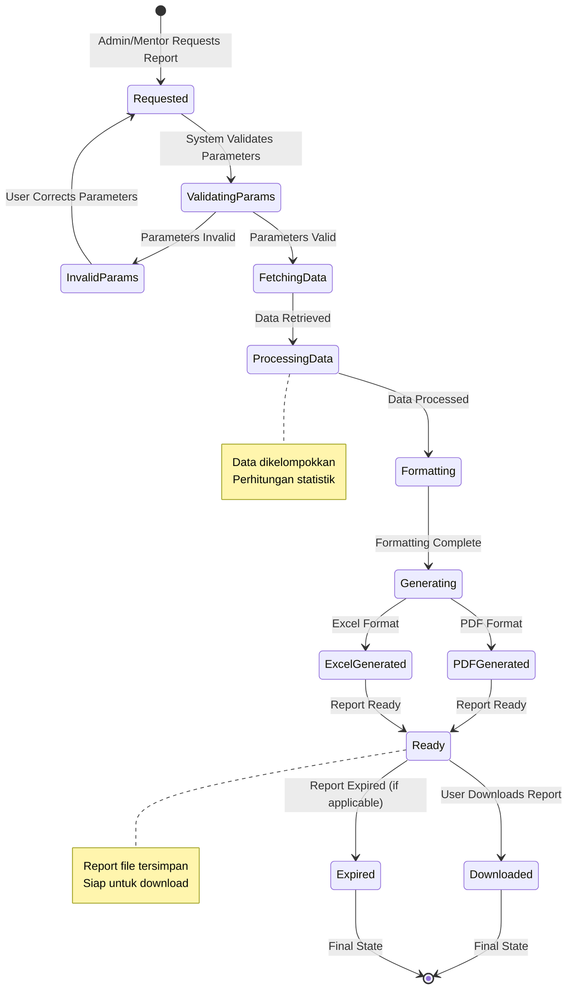

# State Machine Diagram
## Sistem Penerimaan Magang - PT Telkom Indonesia

Diagram ini menunjukkan state machine untuk berbagai entitas dalam sistem.

---

## State Machine - Internship Application Status

---

## State Machine - User Authentication State

---

## State Machine - Assignment Status

---

## State Machine - Attendance Status

---

## State Machine - Certificate Status

---

## State Machine - User Account State

---

## State Machine - Document Upload Status

---

## State Machine - 2FA Setup State

---

## State Machine - Report Generation State

---

## State Transition Table - Internship Application

| Current State | Event | Next State | Action |
|--------------|-------|------------|--------|
| Pending | Mentor Approves | Accepted | Send notification, Create acceptance letter |
| Pending | Mentor/Admin Rejects | Rejected | Send rejection notification |
| Accepted | Internship Completed | Finished | Generate certificate eligibility |
| Accepted | Internship Postponed | Postponed | Update dates, notify user |
| Accepted | Rejected After Acceptance | Rejected | Send notification |
| Postponed | Resumed | Accepted | Update dates |
| Postponed | Cancelled | Rejected | Send notification |
| Rejected | User Reapplies | Pending | Create new application |

---

## State Transition Table - Assignment

| Current State | Event | Next State | Action |
|--------------|-------|------------|--------|
| Created | Assigned to Student | Assigned | Send notification |
| Assigned | Student Starts | InProgress | Record start time |
| Assigned | Deadline Passed | Overdue | Send reminder |
| InProgress | Student Submits | Submitted | Store submission file |
| InProgress | Deadline Passed | Overdue | Mark as overdue |
| Submitted | Mentor Reviews | UnderReview | Set review status |
| UnderReview | Mentor Grades | Graded | Store grade, send notification |
| UnderReview | Revision Needed | NeedsRevision | Send feedback |
| NeedsRevision | Student Revises | InProgress | Update submission |

---

**Dibuat**: 2024  
**Versi**: 1.0  
**Sistem**: Penerimaan Magang PT Telkom Indonesia

