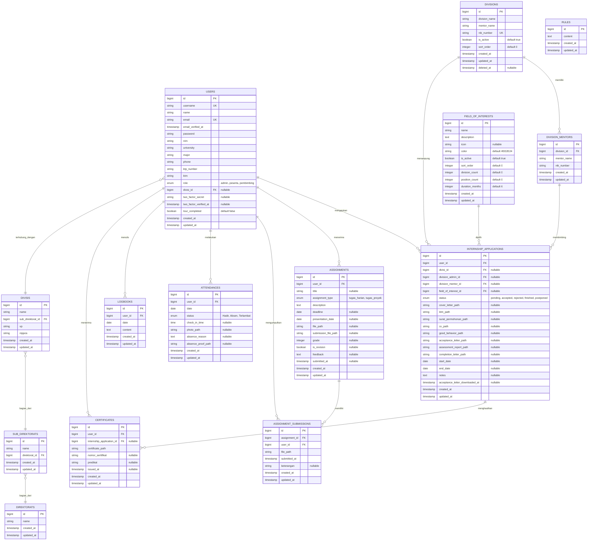

# ERD Mermaid Code - Siap Copy Paste
## Sistem Penerimaan Magang - PT Telkom Indonesia

File ini berisi kode Mermaid yang sudah siap untuk di-copy dan digunakan di:
- Mermaid Live Editor (https://mermaid.live/)
- VS Code dengan Mermaid extension
- GitHub/GitLab markdown
- Dokumentasi lainnya

---

## Kode Mermaid ERD Lengkap

Copy seluruh kode di bawah ini ke Mermaid Live Editor untuk generate gambar:



---

## Cara Menggunakan

### 1. Convert ke PNG/SVG menggunakan Mermaid Live Editor

**Langkah-langkah:**
1. Buka browser dan kunjungi: **https://mermaid.live/**
2. Copy seluruh kode di atas (mulai dari `erDiagram` sampai `}` terakhir)
3. Paste ke editor di mermaid.live
4. Diagram akan otomatis ter-render
5. Klik tombol **"Actions"** (di pojok kanan atas)
6. Pilih:
   - **"Download PNG"** untuk format gambar PNG
   - **"Download SVG"** untuk format vektor (recommended)
   - **"Copy PNG"** untuk copy ke clipboard

**Keuntungan:**
- ✅ Gratis dan online
- ✅ Tidak perlu install software
- ✅ Export langsung ke PNG/SVG
- ✅ Bisa edit sebelum export

---

### 2. Convert menggunakan Mermaid CLI (Command Line)

**Install Mermaid CLI:**
```bash
npm install -g @mermaid-js/mermaid-cli
```

**Buat file `erd.mmd`:**
Copy kode di atas dan simpan sebagai `erd.mmd`

**Convert ke PNG:**
```bash
mmdc -i erd.mmd -o ERD_PENERIMAAN_MAGANG.png -b transparent -w 2400
```

**Convert ke SVG:**
```bash
mmdc -i erd.mmd -o ERD_PENERIMAAN_MAGANG.svg
```

**Convert ke PDF:**
```bash
mmdc -i erd.mmd -o ERD_PENERIMAAN_MAGANG.pdf
```

**Options:**
- `-i` = input file
- `-o` = output file
- `-b` = background color (transparent, white, dll)
- `-w` = width (default 1200)
- `-H` = height (optional)

---

### 3. Menggunakan VS Code

**Install Extension:**
1. Install extension **"Markdown Preview Mermaid Support"** di VS Code
2. Buat file markdown baru
3. Paste kode di atas dengan format:
   ` ```mermaid ` ... ` ``` `
4. Buka preview dengan `Ctrl+Shift+V` (Windows/Linux) atau `Cmd+Shift+V` (Mac)
5. Klik kanan pada diagram → "Save Image As"

---

### 4. Menggunakan GitHub/GitLab

Jika file ini di-upload ke GitHub/GitLab:
1. GitHub/GitLab akan otomatis render diagram Mermaid
2. Screenshot diagram untuk mendapatkan gambar
3. Atau gunakan GitHub API untuk export

---

## Tips untuk Hasil Terbaik

### 1. Resolusi Tinggi
Saat export, gunakan resolusi tinggi untuk kualitas terbaik:
- PNG: Minimal 2400px width
- SVG: Selalu vektor (infinite resolution)

### 2. Background Transparent
Gunakan background transparent jika ingin memasukkan ke dokumen:
```bash
mmdc -i erd.mmd -o erd.png -b transparent
```

### 3. Custom Styling (Advanced)
Untuk styling custom, buat file `config.json`:
```json
{
  "theme": "default",
  "themeVariables": {
    "primaryColor": "#dae8fc",
    "primaryTextColor": "#000",
    "primaryBorderColor": "#6c8ebf",
    "lineColor": "#333",
    "secondaryColor": "#d5e8d4",
    "tertiaryColor": "#fff2cc"
  }
}
```

Gunakan dengan:
```bash
mmdc -i erd.mmd -o erd.png -c config.json
```

---

## Troubleshooting

### Problem: Diagram terlalu besar/kecil
**Solusi:**
- Adjust width di Mermaid CLI: `-w 3000` untuk lebih besar
- Atau gunakan zoom di Mermaid Live Editor sebelum export

### Problem: Beberapa relasi tidak muncul
**Solusi:**
- Pastikan semua entity didefinisikan sebelum relasi
- Check syntax Mermaid (tidak ada typo)

### Problem: Teks terpotong
**Solusi:**
- Export sebagai SVG untuk text yang tetap editable
- Atau increase width saat export

---

## Links Berguna

- **Mermaid Live Editor**: https://mermaid.live/
- **Mermaid Documentation**: https://mermaid.js.org/
- **Mermaid CLI**: https://github.com/mermaid-js/mermaid-cli
- **Mermaid Examples**: https://mermaid.js.org/ecosystem/tutorials.html

---

**Selamat menggunakan!** 🚀

Jika ada pertanyaan atau issue, pastikan syntax Mermaid sudah benar dan semua entity sudah didefinisikan.


