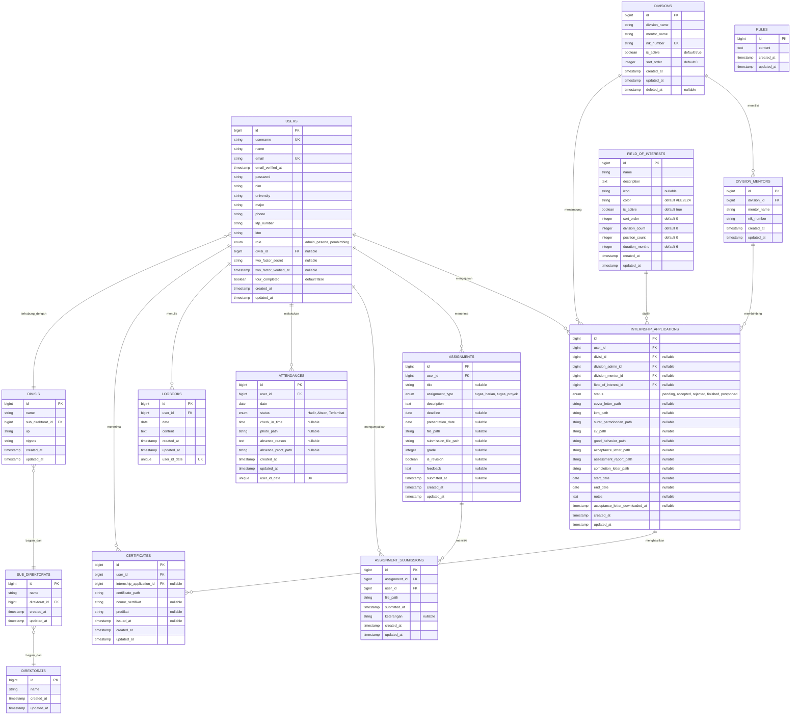

# Entity Relationship Diagram (ERD)
## Sistem Penerimaan Magang - PT Telkom Indonesia

Dokumen ini berisi Entity Relationship Diagram (ERD) untuk database sistem penerimaan magang berbasis web.

---

## Diagram ERD

---

## Deskripsi Entitas

### 1. USERS (Pengguna)
Tabel utama untuk menyimpan data semua pengguna sistem (Admin, Peserta, dan Pembimbing).

**Atribut Utama:**
- `id`: Primary Key
- `username`: Username unik untuk login
- `email`: Email unik pengguna
- `role`: Role pengguna (admin, peserta, pembimbing)
- `divisi_id`: Foreign key ke tabel DIVISIS (untuk pembimbing)
- `two_factor_secret`: Secret untuk Two-Factor Authentication
- `two_factor_verified_at`: Waktu verifikasi 2FA

**Relasi:**
- One-to-Many dengan INTERNSHIP_APPLICATIONS
- One-to-Many dengan ASSIGNMENTS
- One-to-Many dengan ASSIGNMENT_SUBMISSIONS
- One-to-Many dengan ATTENDANCES
- One-to-Many dengan LOGBOOKS
- One-to-Many dengan CERTIFICATES
- Many-to-One dengan DIVISIS

---

### 2. DIREKTORATS (Direktorat)
Tabel untuk menyimpan data direktorat dalam struktur organisasi.

**Atribut Utama:**
- `id`: Primary Key
- `name`: Nama direktorat

**Relasi:**
- One-to-Many dengan SUB_DIREKTORATS

---

### 3. SUB_DIREKTORATS (Sub Direktorat)
Tabel untuk menyimpan data sub direktorat yang berada di bawah direktorat.

**Atribut Utama:**
- `id`: Primary Key
- `name`: Nama sub direktorat
- `direktorat_id`: Foreign key ke DIREKTORATS

**Relasi:**
- Many-to-One dengan DIREKTORATS
- One-to-Many dengan DIVISIS

---

### 4. DIVISIS (Divisi - Struktur Lama)
Tabel untuk menyimpan data divisi dalam struktur organisasi lama (hierarki Direktorat > Sub Direktorat > Divisi).

**Atribut Utama:**
- `id`: Primary Key
- `name`: Nama divisi
- `sub_direktorat_id`: Foreign key ke SUB_DIREKTORATS
- `vp`: Nama VP (Vice President)
- `nippos`: NIPPOS divisi

**Relasi:**
- Many-to-One dengan SUB_DIREKTORATS
- One-to-Many dengan USERS (untuk pembimbing)
- One-to-Many dengan INTERNSHIP_APPLICATIONS

---

### 5. DIVISIONS (Divisi - Struktur Baru)
Tabel untuk menyimpan data divisi dalam struktur organisasi baru (sistem baru yang lebih sederhana).

**Atribut Utama:**
- `id`: Primary Key
- `division_name`: Nama divisi
- `mentor_name`: Nama mentor/pembimbing utama
- `nik_number`: NIK mentor (unique)
- `is_active`: Status aktif divisi
- `sort_order`: Urutan tampil divisi
- `deleted_at`: Soft delete timestamp

**Relasi:**
- One-to-Many dengan DIVISION_MENTORS
- One-to-Many dengan INTERNSHIP_APPLICATIONS

---

### 6. DIVISION_MENTORS (Pembimbing Divisi)
Tabel untuk menyimpan data pembimbing/mentor untuk setiap divisi (multiple mentors per division).

**Atribut Utama:**
- `id`: Primary Key
- `division_id`: Foreign key ke DIVISIONS
- `mentor_name`: Nama mentor
- `nik_number`: NIK mentor

**Relasi:**
- Many-to-One dengan DIVISIONS
- One-to-Many dengan INTERNSHIP_APPLICATIONS

---

### 7. FIELD_OF_INTERESTS (Bidang Peminatan)
Tabel untuk menyimpan data bidang peminatan/field of interest yang tersedia.

**Atribut Utama:**
- `id`: Primary Key
- `name`: Nama bidang peminatan
- `description`: Deskripsi bidang
- `icon`: Icon (FontAwesome class)
- `color`: Warna hex untuk UI
- `is_active`: Status aktif
- `sort_order`: Urutan tampil
- `division_count`: Jumlah divisi yang tersedia
- `position_count`: Jumlah posisi yang tersedia
- `duration_months`: Durasi magang dalam bulan

**Relasi:**
- One-to-Many dengan INTERNSHIP_APPLICATIONS

---

### 8. INTERNSHIP_APPLICATIONS (Pengajuan Magang)
Tabel utama untuk menyimpan data pengajuan magang dari peserta.

**Atribut Utama:**
- `id`: Primary Key
- `user_id`: Foreign key ke USERS (peserta yang mengajukan)
- `divisi_id`: Foreign key ke DIVISIS (struktur lama, nullable)
- `division_admin_id`: Foreign key ke DIVISIONS (struktur baru, nullable)
- `division_mentor_id`: Foreign key ke DIVISION_MENTORS (pembimbing yang ditugaskan)
- `field_of_interest_id`: Foreign key ke FIELD_OF_INTERESTS
- `status`: Status pengajuan (pending, accepted, rejected, finished, postponed)
- `cover_letter_path`: Path file surat pengantar
- `ktm_path`: Path file KTM
- `surat_permohonan_path`: Path file surat permohonan
- `cv_path`: Path file CV
- `good_behavior_path`: Path file surat keterangan berkelakuan baik
- `acceptance_letter_path`: Path file surat penerimaan
- `assessment_report_path`: Path file laporan penilaian
- `completion_letter_path`: Path file surat selesai magang
- `start_date`: Tanggal mulai magang
- `end_date`: Tanggal selesai magang
- `notes`: Catatan admin/mentor

**Relasi:**
- Many-to-One dengan USERS
- Many-to-One dengan DIVISIS (nullable)
- Many-to-One dengan DIVISIONS (nullable)
- Many-to-One dengan DIVISION_MENTORS (nullable)
- Many-to-One dengan FIELD_OF_INTERESTS
- One-to-Many dengan CERTIFICATES

---

### 9. ASSIGNMENTS (Penugasan)
Tabel untuk menyimpan data tugas yang diberikan mentor kepada peserta.

**Atribut Utama:**
- `id`: Primary Key
- `user_id`: Foreign key ke USERS (peserta yang menerima tugas)
- `title`: Judul tugas
- `assignment_type`: Jenis tugas (tugas_harian, tugas_proyek)
- `description`: Deskripsi tugas
- `deadline`: Batas waktu pengumpulan
- `presentation_date`: Tanggal presentasi (untuk tugas proyek)
- `file_path`: Path file tugas (dari mentor)
- `submission_file_path`: Path file pengumpulan (dari peserta)
- `grade`: Nilai tugas
- `is_revision`: Flag apakah perlu revisi
- `feedback`: Feedback dari mentor
- `submitted_at`: Waktu pengumpulan

**Relasi:**
- Many-to-One dengan USERS
- One-to-Many dengan ASSIGNMENT_SUBMISSIONS

---

### 10. ASSIGNMENT_SUBMISSIONS (Pengumpulan Tugas)
Tabel untuk menyimpan history pengumpulan tugas (multiple submissions per assignment).

**Atribut Utama:**
- `id`: Primary Key
- `assignment_id`: Foreign key ke ASSIGNMENTS
- `user_id`: Foreign key ke USERS
- `file_path`: Path file yang dikumpulkan
- `submitted_at`: Waktu pengumpulan
- `keterangan`: Keterangan pengumpulan

**Relasi:**
- Many-to-One dengan ASSIGNMENTS
- Many-to-One dengan USERS

---

### 11. ATTENDANCES (Absensi)
Tabel untuk menyimpan data absensi peserta magang.

**Atribut Utama:**
- `id`: Primary Key
- `user_id`: Foreign key ke USERS
- `date`: Tanggal absensi
- `status`: Status kehadiran (Hadir, Absen, Terlambat)
- `check_in_time`: Waktu check-in
- `photo_path`: Path foto selfie saat check-in
- `absence_reason`: Alasan jika absen
- `absence_proof_path`: Path bukti absen (file)

**Constraint:**
- Unique constraint: `(user_id, date)` - satu user hanya bisa absen sekali per hari

**Relasi:**
- Many-to-One dengan USERS

---

### 12. LOGBOOKS (Logbook)
Tabel untuk menyimpan data logbook harian peserta magang.

**Atribut Utama:**
- `id`: Primary Key
- `user_id`: Foreign key ke USERS
- `date`: Tanggal logbook
- `content`: Isi logbook

**Constraint:**
- Unique constraint: `(user_id, date)` - satu user hanya bisa menulis satu logbook per hari

**Relasi:**
- Many-to-One dengan USERS

---

### 13. CERTIFICATES (Sertifikat)
Tabel untuk menyimpan data sertifikat yang diterbitkan untuk peserta magang.

**Atribut Utama:**
- `id`: Primary Key
- `user_id`: Foreign key ke USERS
- `internship_application_id`: Foreign key ke INTERNSHIP_APPLICATIONS
- `certificate_path`: Path file sertifikat
- `nomor_sertifikat`: Nomor sertifikat
- `predikat`: Predikat nilai (Sangat Baik, Baik, Cukup)
- `issued_at`: Waktu penerbitan sertifikat

**Relasi:**
- Many-to-One dengan USERS
- Many-to-One dengan INTERNSHIP_APPLICATIONS

---

### 14. RULES (Aturan)
Tabel untuk menyimpan aturan-aturan sistem yang dapat diubah oleh admin.

**Atribut Utama:**
- `id`: Primary Key
- `content`: Isi aturan (text)

**Relasi:**
- Tidak ada relasi dengan entitas lain (standalone)

---

## Keterangan Relasi

### Cardinality dan Relasi

1. **USERS ↔ INTERNSHIP_APPLICATIONS**: One-to-Many
   - Satu user dapat memiliki banyak pengajuan magang
   - Satu pengajuan magang dimiliki oleh satu user

2. **USERS ↔ ASSIGNMENTS**: One-to-Many
   - Satu user (peserta) dapat menerima banyak tugas
   - Satu tugas diberikan kepada satu user

3. **USERS ↔ ASSIGNMENT_SUBMISSIONS**: One-to-Many
   - Satu user dapat mengumpulkan banyak submission
   - Satu submission dibuat oleh satu user

4. **USERS ↔ ATTENDANCES**: One-to-Many
   - Satu user dapat memiliki banyak record absensi
   - Satu record absensi dimiliki oleh satu user

5. **USERS ↔ LOGBOOKS**: One-to-Many
   - Satu user dapat memiliki banyak logbook
   - Satu logbook dimiliki oleh satu user

6. **USERS ↔ CERTIFICATES**: One-to-Many
   - Satu user dapat memiliki banyak sertifikat
   - Satu sertifikat dimiliki oleh satu user

7. **DIVISIS ↔ USERS**: One-to-Many
   - Satu divisi dapat memiliki banyak pembimbing (users dengan role pembimbing)
   - Satu pembimbing terhubung dengan satu divisi

8. **DIREKTORATS → SUB_DIREKTORATS → DIVISIS**: Hierarki One-to-Many
   - Satu direktorat memiliki banyak sub direktorat
   - Satu sub direktorat memiliki banyak divisi

9. **DIVISIONS ↔ DIVISION_MENTORS**: One-to-Many
   - Satu divisi dapat memiliki banyak mentor
   - Satu mentor terhubung dengan satu divisi

10. **DIVISION_MENTORS ↔ INTERNSHIP_APPLICATIONS**: One-to-Many
    - Satu mentor dapat membimbing banyak pengajuan magang
    - Satu pengajuan magang dibimbing oleh satu mentor

11. **DIVISIONS ↔ INTERNSHIP_APPLICATIONS**: One-to-Many
    - Satu divisi dapat menampung banyak pengajuan magang
    - Satu pengajuan magang terhubung dengan satu divisi

12. **FIELD_OF_INTERESTS ↔ INTERNSHIP_APPLICATIONS**: One-to-Many
    - Satu field of interest dapat dipilih oleh banyak pengajuan
    - Satu pengajuan memilih satu field of interest

13. **ASSIGNMENTS ↔ ASSIGNMENT_SUBMISSIONS**: One-to-Many
    - Satu assignment dapat memiliki banyak submission (history)
    - Satu submission terkait dengan satu assignment

14. **INTERNSHIP_APPLICATIONS ↔ CERTIFICATES**: One-to-Many
    - Satu pengajuan magang dapat menghasilkan banyak sertifikat
    - Satu sertifikat terkait dengan satu pengajuan magang

---

## Catatan Penting

### 1. Dual Structure untuk Divisi
Sistem memiliki dua struktur divisi:
- **Struktur Lama**: DIREKTORATS → SUB_DIREKTORATS → DIVISIS (hierarki 3 tingkat)
- **Struktur Baru**: DIVISIONS (struktur flat)

Ini dilakukan untuk mendukung migrasi dari struktur lama ke struktur baru. Pada INTERNSHIP_APPLICATIONS, kedua field (`divisi_id` dan `division_admin_id`) dibuat nullable untuk mendukung kedua struktur.

### 2. Soft Delete
Tabel DIVISIONS menggunakan soft delete (kolom `deleted_at`), sehingga data tidak benar-benar dihapus dari database.

### 3. Unique Constraints
- **ATTENDANCES**: Constraint unique pada `(user_id, date)` memastikan satu user hanya bisa absen sekali per hari
- **LOGBOOKS**: Constraint unique pada `(user_id, date)` memastikan satu user hanya bisa menulis satu logbook per hari
- **USERS**: `username` dan `email` memiliki unique constraint
- **DIVISIONS**: `nik_number` memiliki unique constraint

### 4. Enum Values
- **USERS.role**: `admin`, `peserta`, `pembimbing`
- **INTERNSHIP_APPLICATIONS.status**: `pending`, `accepted`, `rejected`, `finished`, `postponed`
- **ASSIGNMENTS.assignment_type**: `tugas_harian`, `tugas_proyek`
- **ATTENDANCES.status**: `Hadir`, `Absen`, `Terlambat`

### 5. Cascade Delete
Sebagian besar foreign key menggunakan `onDelete('cascade')` untuk memastikan data integrity. Ketika parent record dihapus, child records juga akan terhapus.

---

## Tools untuk Viewing Diagram

Diagram ERD di atas menggunakan syntax **Mermaid.js**. Anda dapat melihat diagram ini di:

1. **GitHub/GitLab**: Otomatis dirender saat commit file .md
2. **VS Code**: Install extension "Markdown Preview Mermaid Support"
3. **Online**: https://mermaid.live/
4. **Documentation tools**: Doxygen, MkDocs, dll.

---

**Dibuat**: 2024  
**Versi**: 1.0  
**Sistem**: Penerimaan Magang PT Telkom Indonesia

